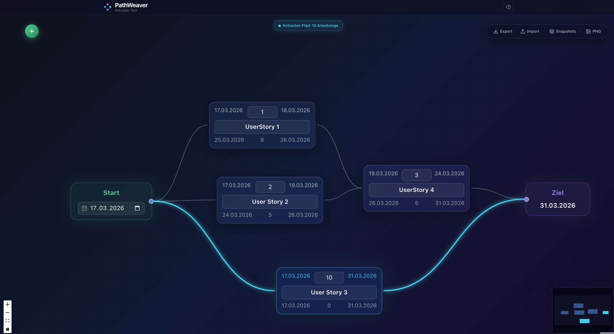

<div align="center">

# PathWeaver

**A lightweight, browser-based Critical Path Method (CPM) planner.**

Model project dependencies visually, identify your critical path instantly, and share results as PNG or JSON — no server required, no sign-up, no complexity.

[](https://github.com/scifishelf/pathweaver/actions/workflows/deploy-hetzner.yml)
[](https://www.typescriptlang.org/)
[](https://react.dev/)
[](LICENSE)

<br/>



</div>

---

## What is PathWeaver?

PathWeaver turns project planning back into something simple. You draw nodes, connect them with edges, set durations — and the tool instantly calculates which path is critical, when the project finishes earliest, and how much float every task has.

Everything runs in the browser using LocalStorage. There is no backend, no account, and no data leaving your machine.

## Features

- **Interactive graph editor** — drag and drop Start, Task, and End nodes; connect them by pulling handles
- **Real-time CPM computation** — forward pass, backward pass, ES/EF/LS/LF, and slack for every node
- **Critical path highlighting** — all parallel critical paths glow in cyan; multi-successor and diamond graphs fully supported
- **Date-aware scheduling** — set a project start date; PathWeaver derives concrete dates for every node skipping weekends
- **Graph validation** — cycle detection, orphan checks, structural rules, with inline error banners
- **JSON import / export** — machine-readable project files with a [documented schema](docs/json-format.md)
- **PNG export** — snapshot the current canvas as a high-quality image
- **Local snapshots** — save, reload, and delete named project states via LocalStorage
- **Zero dependencies on the server side** — fully offline-capable

## Quick Start

**Prerequisites:** [Node.js](https://nodejs.org/) LTS (18 or later)

```bash
# 1. Clone the repository
git clone https://github.com/scifishelf/pathweaver.git
cd pathweaver

# 2. Install dependencies
cd web
npm install

# 3. Start the development server
npm run dev
```

Open **http://localhost:5173** in your browser. That's it.

## Usage

| Action | How |
|---|---|
| Add a task | Click the green **+** button (bottom-right) |
| Connect nodes | Drag from a node's handle to another node |
| Edit title / duration | Click directly on the text inside a node |
| Set project start date | Edit the date field in the **Start** node |
| Delete a node or edge | Right-click → context menu |
| Export as JSON | Toolbar → **Export JSON** |
| Import a project | Toolbar → **Import JSON** |
| Export as PNG | Toolbar → **Export PNG** |
| Save a snapshot | Toolbar → **Snapshots** → Save |
| Show help | Toolbar → **?** |

## Tech Stack

| Layer | Technology |
|---|---|
| UI framework | React 19 + TypeScript 5 |
| Graph rendering | React Flow 11 |
| Build tool | Vite 7 |
| Styling | Tailwind CSS 4 |
| Date math | date-fns 4 |
| PNG export | html-to-image |
| Unit tests | Vitest 3 + Testing Library |
| E2E tests | Playwright |
| Linting | ESLint 9 + Prettier |

## Project Structure

```
pathweaver/
├── web/                       # The browser application
│   └── src/
│       ├── cpm/               # CPM algorithm (compute.ts, types.ts, workdays.ts)
│       ├── graph/             # Node components, validation, design tokens
│       ├── components/        # UI: Toolbar, Canvas, Modals, Banners
│       └── persistence/       # LocalStorage autosave and snapshots
├── docs/
│   ├── json-format.md         # Project file format specification
│   ├── json-schema.v1.json    # JSON Schema for validation
│   └── testdaten/             # Example project files
└── .github/workflows/         # CI/CD (deploy to Hetzner)
```

## Data Format

Projects are stored as JSON files. The format is fully documented in [`docs/json-format.md`](docs/json-format.md) and validated by [`docs/json-schema.v1.json`](docs/json-schema.v1.json).

**Minimal example:**

```json
{
  "settings": { "version": "1.0", "startDate": "2025-01-06" },
  "nodes": [
    { "id": "S",  "type": "start", "x": 0,   "y": 200 },
    { "id": "N1", "type": "task",  "x": 250, "y": 200, "title": "Analysis", "duration": 5 },
    { "id": "N2", "type": "task",  "x": 500, "y": 200, "title": "Build",    "duration": 10 },
    { "id": "E",  "type": "end",   "x": 750, "y": 200 }
  ],
  "edges": [
    { "from": "S",  "to": "N1" },
    { "from": "N1", "to": "N2" },
    { "from": "N2", "to": "E"  }
  ]
}
```

**Graph rules enforced by the engine:**
- Exactly one `start` node and one `end` node
- Task nodes may have **any number of outgoing edges** (fan-out) and any number of incoming edges (merge)
- All nodes must be reachable from `start`; no cycles or duplicate edges permitted
- Merge nodes: ES = max of all incoming EF values (correct multi-predecessor CPM)

## Development

```bash
cd web

npm run dev          # Vite dev server with HMR
npm run build        # Type-check + production build
npm run test         # Run unit tests (Vitest)
npm run test:ui      # Vitest with browser UI
npm run e2e          # Playwright end-to-end tests
npm run lint         # ESLint
npm run preview      # Preview the production build locally
```

For contribution guidelines, coding standards, and the pull request process, see [CONTRIBUTING.md](CONTRIBUTING.md).

## Demo Files

The [`docs/testdaten/`](docs/testdaten/) directory contains ready-to-import example projects:

| File | Description |
|---|---|
| `doenerladen-tagesablauf.json` | Döner shop daily workflow — small graph, two parallel prep tracks |
| `mars-kolonisierung.json` | Mars colonization project — 50 nodes, 10 parallel R&D streams, 3 milestones |

## License

[MIT](LICENSE) — see [`LICENSE`](LICENSE) for details.
